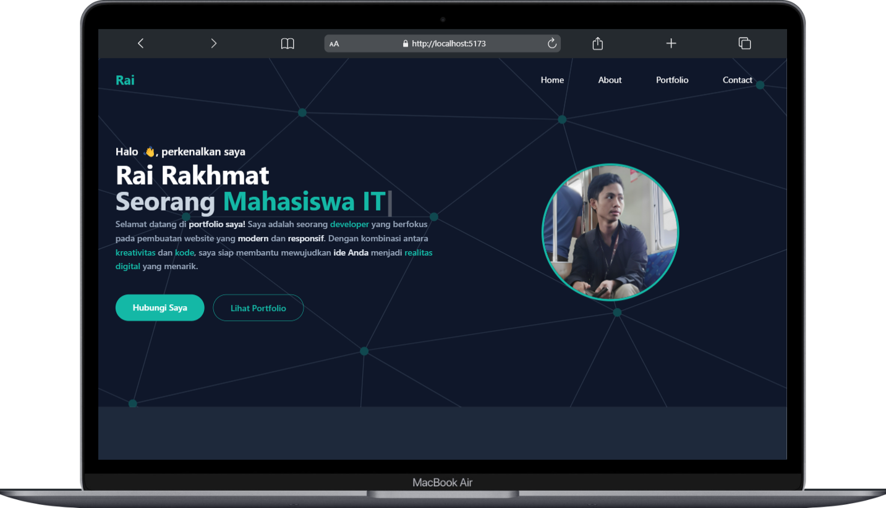

# Portfolio Website - Rai

<p align="center">
  
</p>

## 🌟 Tentang Aplikasi

Portfolio website modern yang dibangun dengan React dan Tailwind CSS. Website ini menampilkan informasi personal, skill, project, dan kontak dalam tampilan yang menarik dan responsif. Dilengkapi dengan animasi smooth menggunakan Framer Motion dan efek typing menggunakan Typed.js.

## ✨ Fitur Utama

- 🎨 Design modern dan responsif
- 🎭 Animasi halus dengan Framer Motion
- ⌨️ Efek typing dengan Typed.js
- 📱 Mobile-friendly navigation
- 🎯 Smooth scroll ke setiap section
- ⚡ Performa optimal dengan Vite
- 🎪 Showcase tech stack
- 📂 Showcase portfolio
- 📬 Section kontak

## 🛠️ Tech Stack

- **Framework:** React + Vite
- **Styling:** Tailwind CSS
- **Animation:** Framer Motion
- **Icons:** React Icons
- **Typing Effect:** Typed.js
- **Package Manager:** npm
- **Deployment:** Vercel

## 📋 Persyaratan

- Node.js 16.x atau lebih baru
- npm 7.x atau lebih baru
- Git

## 🚀 Cara Penggunaan

1. **Clone Repository**

   ```bash
   git clone https://github.com/BahasKoding/portfolio-rai.git
   cd portfolio-rai
   ```

2. **Install Dependencies**

   ```bash
   npm install
   ```

3. **Jalankan Development Server**

   ```bash
   npm run dev
   ```

   Website akan berjalan di `http://localhost:5173`.

---

<p align="center">
  Made with ❤️ by Rai 
</p>

